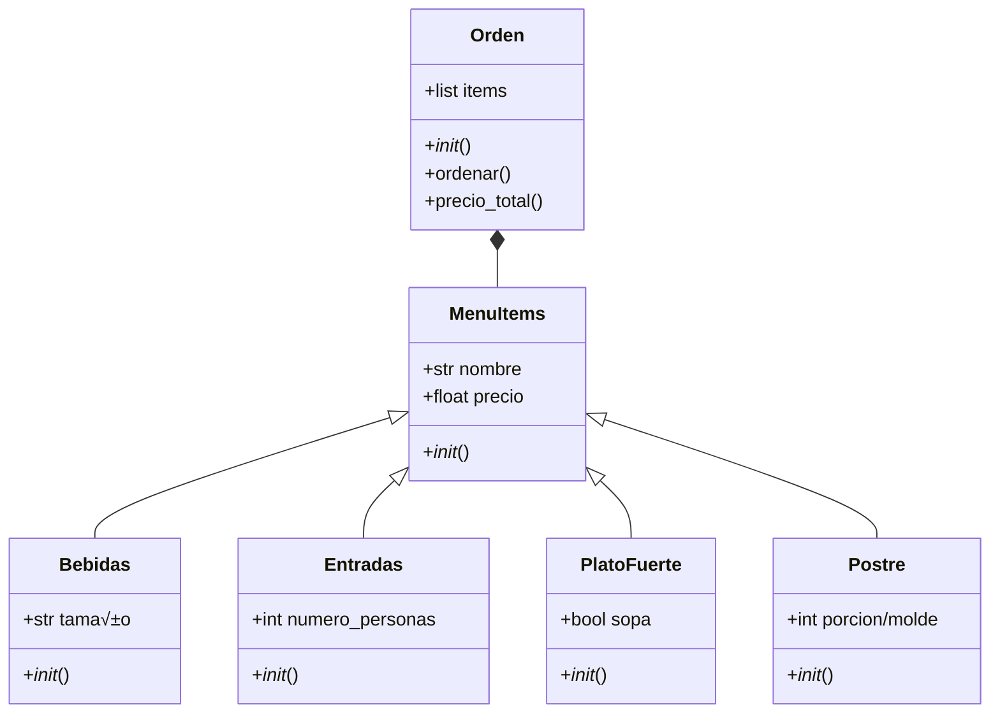

#Diagrama de clases ejercicio restaurante:

```mermaid
classDiagram
direction TB
  class Orden {
      +list items
      +_init_()
      +ordenar()
      +precio_total()
  }
  class MenuItems{
    +str nombre
      +float precio
      +_init_()
  }
  class Bebidas {
      +str tamaño
      +_init_()
  }
  class Entradas {
    +int numero_personas
      +_init_()
  }
  class PlatoFuerte{
      +bool sopa
      +_init_()
  }
  class Postre{
      +int porcion/molde
      +_init_()
  }
  Orden *-- MenuItems
  MenuItems <|-- Bebidas
  MenuItems <|-- Entradas
  MenuItems <|-- PlatoFuerte
  MenuItems <|-- Postre
```
